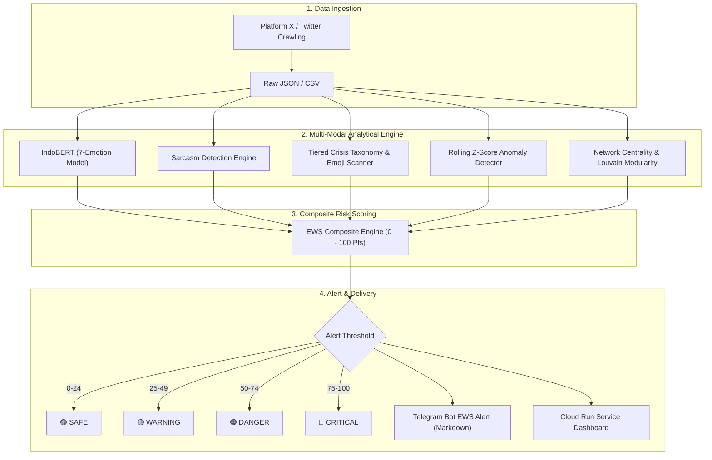

# MBG Early Warning System (EWS) v2

## 1. Scientific Purpose

EWS v2 is a research prototype for early detection of escalating public discourse concerning Indonesia's Makan Bergizi Gratis (MBG) policy.

The system integrates:
1. Emotion classification (IndoBERT fine-tuned)
2. Sarcasm detection (Pragmatic contrast modeling)
3. Crisis keyword and emoji detection (3-Tiered taxonomy)
4. Conversation-volume deviation
5. Temporal anomaly detection (Rolling Z-score statistics)
6. Social Network Analysis (SNA network topology)
7. Multi-dimensional risk scoring (0 – 100 scale)
8. Automated alert delivery (Telegram Bot & Cloud Run Jobs)

The system is designed as an **empirical risk-scoring framework** to assist public policy analysts and the National Nutrition Agency (*Badan Gizi Nasional* / BGN) in bridging the *Phygital Gap* through rapid public communication responses.

---

## 2. Conceptual Problem & Pragmatic Contrast

Conventional sentiment analysis frequently misclassifies sarcastic criticism as positive sentiment.

### Example:
> *"Luar biasa menu MBG hari ini, belatungnya bikin berprotein tinggi 👍✨🤡"*

The presence of positive lexical expressions (*"luar biasa"*, *"berprotein tinggi"*) and positive emojis (*👍, ✨*) often masks severe negative pragmatic meaning and operational crisis indicators.

Therefore, EWS v2 combines deep NLP semantics, sarcasm contrast modeling, tiered crisis indicators, temporal volume signals, and network topology.

---

## 3. EWS Risk Model

The total risk score is bounded within:
$$\text{EWS\_TOTAL} \in [0, 100]$$

### Component Weight Breakdown:

| Component | Maximum Points | Empirical Basis |
|---|---:|---|
| **Emotion Risk** | 30 | Ratio of crisis-associated emotions (*Jijik*, *Marah*, *Takut*, *Sedih*) via IndoBERT |
| **Sarcasm Risk** | 20 | Proportion of sarcastic/ironic criticism (*Pragmatic contrast*) |
| **Crisis Keyword / Emoji Risk** | 20 | 3-Tiered crisis vocabulary & cynical emoji penalty |
| **Volume Risk** | 15 | Observed daily volume deviation from baseline ($V / \bar{V}$) |
| **Anomaly Risk** | 15 | Temporal Z-score anomaly frequency ($Z \ge 2.0$) |
| **TOTAL** | **100** | **Holistic Composite Risk Index** |

---

### 3.1 Emotion Risk — 30 Points
* **Model:** IndoBERT fine-tuned for Indonesian emotion classification.
* **Crisis-Associated Classes:** *Jijik* (Disgust), *Marah* (Anger), *Takut* (Fear), and *Sedih* (Sadness).
* **Formula:**
  $$\text{Score}_{\text{emo}} = \min\left(30.0, \; \frac{N_{\text{crisis\_emotions}}}{N_{\text{total}}} \times 30.0 \times 1.5\right)$$

---

### 3.2 Sarcasm Risk — 20 Points
* **Definition:** Identifies discourse where positive surface polarity contrasts with negative pragmatic intent.
* **Markers:** Praise vocabulary combined with crisis nouns, positive emojis adjacent to cynical emojis (🤡, 🤮), or explicit mockery.
* **Formula:**
  $$\text{Score}_{\text{sar}} = \min\left(20.0, \; \text{Ratio}_{\text{sarcasm}} \times 20.0 \times 2.0\right)$$

---

### 3.3 Crisis Keyword & Emoji Risk — 20 Points

The vocabulary uses a 3-tier severity taxonomy tailored to the MBG context:

* **Tier 1 (Medical & Physical Emergency - Highest Weight):**
  * Keywords: *keracunan, dirawat, opname, pingsan, ambulans, rumah sakit, muntah, diare, meninggal, mati, gawat darurat*.
* **Tier 2 (Hygiene, Food Quality, & Governance):**
  * Keywords: *basi, busuk, belatung, ulat, kotor, menjijikkan, korupsi, vendor bodong, vendor fiktif, dibekukan, ditutup, SPPG*.
* **Tier 3 (Public Discontent & Trust Deficit):**
  * Keywords: *kecewa, bohong, anggaran bengkak, tidak layak, janji palsu, omong kosong, tipuan, hambar, gagal*.
* **Cynical / Mockery Emojis:**
  * Emojis: 🤡, 🤮, 🤢, 😒, 🗑️, 🤦, 🙄, 💩.

---

### 3.4 Volume Risk — 15 Points
Measures deviation of current conversation volume ($V_t$) from established normal baseline volume ($\bar{V}$):
$$\text{Ratio}_{\text{vol}} = \frac{V_t}{\max(\bar{V}, 1)}$$
$$\text{Score}_{\text{vol}} = \min\left(15.0, \; \max\left(0.0, \; (\text{Ratio}_{\text{vol}} - 1.0) \times 7.5\right)\right)$$

---

### 3.5 Anomaly Risk — 15 Points
Temporal anomaly detection uses rolling standardized scores:
$$Z_t = \frac{x_t - \mu_{\text{rolling}}}{\sigma_{\text{rolling}}}$$
* **Configurable Research Threshold:** $Z \ge 2.0$ ($p < 0.05$ extreme spike).
* Anomaly risk reflects the frequency and magnitude of days or hours exceeding this boundary.

---

## 4. Alert Levels & Policy Action Matrix

| Score Range | Status | Level | Operational Interpretation & Policy Response |
|:---:|:---:|:---:|:---|
| **0 – 24** | `SAFE` | 🟢 **Aman** | Normal discourse baseline. Positive/neutral sentiment dominant. Routine automated monitoring. |
| **25 – 49** | `WARNING` | 🟡 **Waspada** | Emerging discontent or localized sarcasm. Map bridge accounts and prepare fact-checking materials. |
| **50 – 74** | `DANGER` | 🟠 **Bahaya** | Tier 2 hygiene/quality complaints escalating. Proactive clarification and kitchen inspection required. |
| **75 – 100** | `CRITICAL` | 🔴 **Kritis** | Severe emergency (e.g., mass food poisoning rumors or acute scandal). Immediate executive intervention within 2–4 hours. |

---

## 5. Social Network Analysis (SNA) Integration

EWS v2 supplements text analytics with network structural topology:
* **Degree Centrality:** Identifies primary discussion hubs and high-volume broadcasters.
* **Betweenness Centrality:** Detects critical **bridge nodes** that facilitate information flow across divergent communities.
* **Louvain Modularity ($Q = 0.9837$):** Measures the degree of structural community partitioning and ideological polarization (*Echo Chambers*).

---

## 6. End-to-End Automated Architecture

